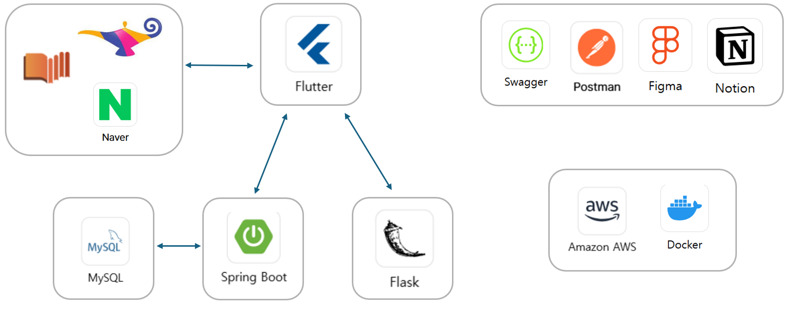
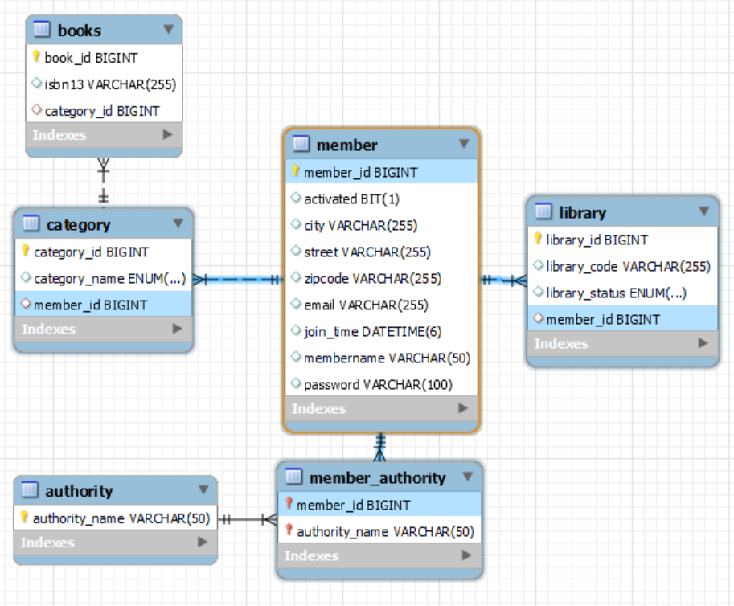

# 📚 책키라웃 - 도서 추천 및 공공도서관 연계 서비스

## 🎯 프로젝트 개요

- 개발 기간: 2024.03 ~ 2024.08 (6개월)
- 팀 구성:
- Frontend Developer 1명(최우혁)
- Backend Developer 1명(허진)
- AI/ML Engineer 1명(이상록)

## 💡 프로젝트 소개

독서 입문자들을 위한 도서 추천 및 공공도서관 연계 서비스

### 프로젝트 배경

- 공공도서관 이용률 저조 및 독서량 감소 문제
- 독서 초보자들의 도서 선택의 어려움

### 프로젝트 목표

사용자 맞춤형 도서 추천과 인근 공공도서관 도서 소장 정보를 제공하는 통합 플랫폼 개발을 통해 독서 진입 장벽 해소

---

## 🏗️ 프로젝트 도식도

## 🛠️ 기술 스택

### Backend

- 주요 언어: Java
- 프레임워크: Spring boot, Data JPA
- 라이브러리: Spring security, Spring web 등
- 데이터베이스: Mysql
- 기타 도구: Postman, Swagger, aws

## 👨‍💻 담당 역할

- Backend 시스템 설계 및 개발
- RESTful API 아키텍처 설계 및 구현
- 데이터베이스 스키마 설계
- API 엔드포인트 개발(Spring을 활용한 서버 구축)
- AWS 클라우드 인프라 구축 및 배포
- EC2 인스턴스 설정 및 관리
- RDS 데이터베이스 구축
- Figma를 전체적 프로젝트 구조 설계
- AI 관련 데이터셋 생성 및 관리

## 📊 프로젝트 ERD

## 🔗 관련 링크

### [⚡ Spring Logic Server Github 링크](https://github.com/Kimheojin/spring_logic0server.git)

### [📄 API 정리 링크](https://documenter.getpostman.com/view/32521050/2sAXjQ1AKk)

### [🎨 프로젝트 로직 관련 초안(Figma)](https://www.figma.com/board/50FKyFe4GNy0Tgpip8T0n0/demo_book-flow-chart?node-id=0-1&t=pI3F2O5IlTXFJhH0-1)

## ⚙️ 주요 구현 내용

#### 보안 및 인증 시스템 구현

- Custom TokenProvider 개발
- JWT 토큰 생성, 검증, 갱신 로직 구현
- 토큰 기반 사용자 인증 및 권한 처리
- 토큰 만료 시간 관리 및 재발급 로직 구현

- Security Filter Chain 커스터마이징
- JWT 인증 필터 구현을 통한 요청/응답 보안 처리
- 사용자 권한 기반 접근 제어 구현
- API 엔드포인트별 인증 요구사항 설정

#### 예외 처리 시스템 구현

- Global Exception Handler 구현
- 비즈니스 로직별 Custom Exception 정의
- 예외 발생 시 일관된 응답 형식 제공
   

## 🚀 기술적 도전 과제 및 연구 성과

### 🏆 학술 연구 성과

- KSC(Korean Software Congress) 2024 Poster 섹션 논문 Accept
- 주제: "Spring Framework 환경에서의 캐싱 전략 비교 및 성능 최적화 연구"

### 📝 연구 내용

#### 연구 목적

- Hibernate Framework와 Spring Framework 환경에서의 다양한 캐싱 전략 분석
- 실제 프로젝트 코드를 활용한 성능 최적화 방안 연구

#### 연구 방법

- 캐싱 전략별 성능 비교 분석
- Data JPA
- JPQL
- Spring 내장 Cache Manager
- 성능 측정 도구
- AOP를 활용한 메서드 실행 시간 측정
- JMeter를 통한 부하 테스트 수행

#### 주요 연구 결과

- Data JPA vs JPQL
- Insert 쿼리 성능: Data JPA 약 2.25배 향상
- Cache Manager 도입 효과
- Select 쿼리 성능: 기존 대비 약 5.75배 Throughput 향상
- 데이터 처리량 대폭 증가

### [📑 논문 보기](./[학부생논문]+Spring+Framework+캐싱+최적화+전략.pdf)

 

## 시연 사진

